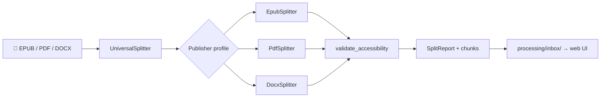

<div align="right">


</div>

# Boundless ♾️

**An accessibility-first EPUB / PDF / DOCX document splitter — designed for educational and universal-design needs.**

> Why should I care? Large course materials hit hard platform limits — Natural Reader caps files at 50MB, and publisher PDFs/EPUBs arrive in wild, inconsistent structures. Boundless splits documents into size-safe chunks while keeping them accessible: WCAG 2.1 AA, ADA, Section 508, and IDEA compliance built into the pipeline, not pasted on after.

## Features

- **♿ Accessibility-first** — ADA (Title II), Section 508, IDEA, WCAG 2.1 AA
- **🏢 Publisher-aware** — automatic profiles handle per-publisher file structures (`auto_create_profiles`)
- **🧩 Modular pipeline** — `EpubSplitter`, `PdfSplitter`, `DocxSplitter` behind one `UniversalSplitter`
- **📦 50MB-safe chunking** — `DEFAULT_MAX_SIZE_MB = 50`, sized for Natural Reader limits
- **🖥️ Accessible web UI** — FastAPI interface on port `10200`, drop EPUBs into `processing/inbox/` for autonomous processing
- **🤖 MCP server** — Model Context Protocol tools for AI-assisted splitting workflows
- **📋 VPAT generation** — machine-generated accessibility conformance reports
- **🗄️ Persistent job engine** — SQLite-backed job history and inbox store

## Pipeline



## Quick start

```bash
pip install -e ".[full]"                      # install with all format support
boundless input.epub -o ./output --max-mb 50 # split a document
boundless-web                                # launch the web UI → http://127.0.0.1:10200
```

More entry points: `boundless-toc` (split by table of contents), `boundless-mcp` (MCP server over stdio). Drop files into `processing/inbox/` and the web UI processes them autonomously.

## Architecture

```
Boundless/
├── src/boundless/
│   ├── universal.py    # UniversalSplitter — the one entry point
│   ├── epub.py         # EpubSplitter (ebooklib + BeautifulSoup)
│   ├── pdf.py          # PdfSplitter (PyMuPDF + PyPDF2)
│   ├── docx.py         # DocxSplitter (python-docx)
│   ├── profile.py      # publisher profiles (EpubProfile, PublisherOrigin)
│   ├── mcp_server.py   # "boundless-splitter" MCP server
│   ├── toc_split.py    # table-of-contents splitting
│   ├── db.py           # SQLite job engine (boundless.db)
│   └── models.py       # SplitReport, ChunkMetadata, A11yLogger
└── web/                # FastAPI web UI (port 10200)
```

### MCP tools

| Tool | What it does |
|---|---|
| `split_document` | split a document, returns the report |
| `validate_accessibility` | check against a standard (default `wcag21_aa`) |
| `generate_vpat` | build a VPAT conformance report |
| `list_edge_cases` | enumerate known edge cases |

Plus MCP resources `docs://legal-framework` (ADA/IDEA/Section 508 summary) and `docs://edge-cases`.

### Python API

```python
from boundless import UniversalSplitter

splitter = UniversalSplitter(max_size_mb=50)
report = splitter.split("input.epub", "./output")
print(f"{len(report.chunks)} chunks")
```

## Config & optional services

| Piece | How | Notes |
|---|---|---|
| Environment | copy [`.env.example`](.env.example) → `.env` | minimal by design |
| Formats | `pip install -e ".[epub,pdf,docx]"` | install only what you need |
| Tray app | `pip install -e ".[tray]"` | `pystray` system tray |
| Live roadmap | [`docs/PLAN-live-trace-streaming.md`](docs/PLAN-live-trace-streaming.md) | live trace streaming plan |

## Dev & contributing

```bash
pip install -e ".[full,dev]"   # dev install
pytest tests/ -v               # run tests
ruff check src/boundless web   # lint (zero ruff errors is the bar)
```

Changes are tracked in [`CHANGELOG.md`](CHANGELOG.md) (Keep a Changelog / SemVer). Please read [`CONTRIBUTING.md`](CONTRIBUTING.md) before opening a PR.

## License & security

Licensed under **MIT** — see [`LICENSE`](LICENSE).

Security: Boundless processes untrusted publisher files by design. Report vulnerabilities via [GitHub Issues](https://github.com/toxicwind/Boundless/issues) with the `security` label, or contact the maintainer directly — see [`SECURITY.md`](SECURITY.md).
